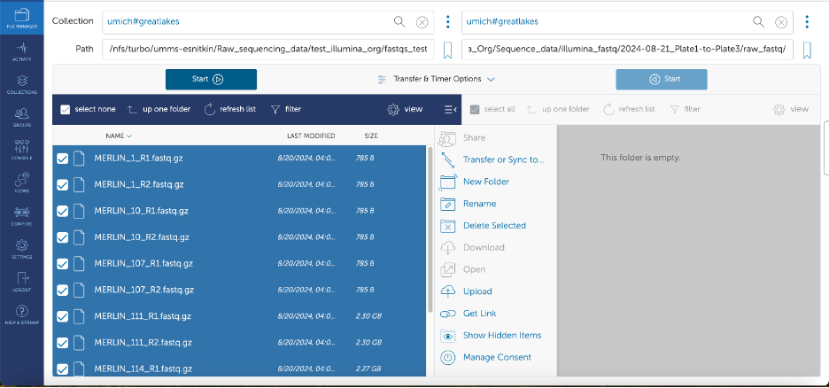
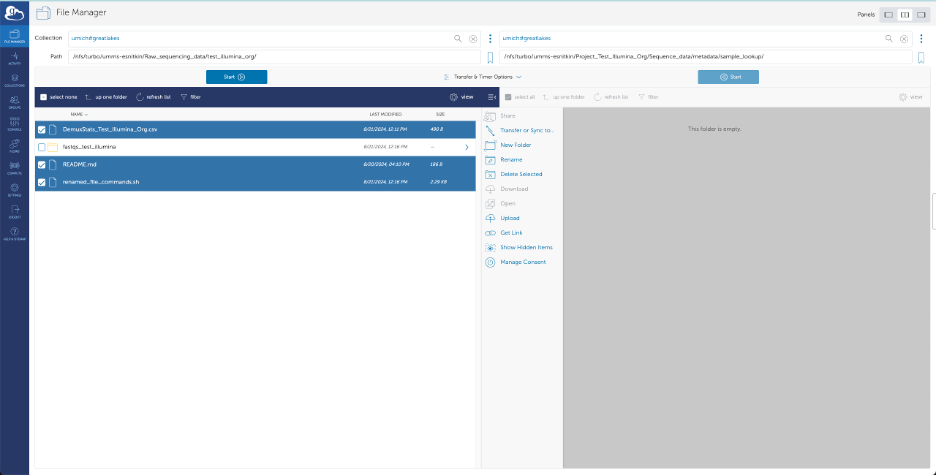

<!--
Author: Dhatri Badri
-->

# Processing illumina samples
The following are crucial steps part of the [Snitkin lab](https://thesnitkinlab.com/index.php) SOP to process your short reads. 
<!--
- [Processing illumina samples](#Processing-illumina-samples)
  - [Getting started](#Getting-started)
  - [Governance Working Group Call Procedures](#governance-working-group-call-procedures)
    - [Preparing for a Call](#preparing-for-a-call)
-->
<!-- comment -->

## Getting started
You need to install the Data Flow SOP from Github and follow the directions in this document to create your project folder on turbo.<!--If your project folder is already created,great—that's one less step for you to do!-->
Please ensure you are cloning the Github repository on your scratch i.e. `/scratch/esnitkin_root/esnitkin1/your_uniqname/`. **All the steps in this SOP are dependent on you succesfully completing the preceding steps.** If you are unable to find the relevant files and/or the instructions are unclear **_please slack Dhatri and do not move forward with the SOP_**.  <!--This script should be run in the directory you are currently in but the path you give is the path to your (already/newly created) project folder on turbo. -->


### Installation

> Clone github directory onto your system.

```
git clone https://github.com/Snitkin-Lab-Umich/Data-Flow-SOP.git
```
> It should look something like this

```
(base) [dhatrib@gl-login2 dhatrib]$ pwd
/scratch/esnitkin_root/esnitkin99/dhatrib
(base) [dhatrib@gl-login2 dhatrib]$ git clone https://github.com/Snitkin-Lab-Umich/Data-Flow-SOP.git
Cloning into 'Data-Flow-SOP'...
remote: Enumerating objects: 11, done.
remote: Counting objects: 100% (11/11), done.
remote: Compressing objects: 100% (8/8), done.
remote: Total 11 (delta 1), reused 8 (delta 1), pack-reused 0 (from 0)
Receiving objects: 100% (11/11), 10.18 KiB | 10.18 MiB/s, done.
Resolving deltas: 100% (1/1), done.
(base) [dhatrib@gl-login2 dhatrib]$ ls
Data-Flow-SOP
```


>Ensure you have successfully cloned Data-Flow-SOP. Type ls and you should see the newly created directory Data-Flow-SOP. Move to the newly created directory.

```
cd Data-Flow-SOP
```
> This is what your `Data-Flow-SOP` folder should look like
```
(base) [dhatrib@gl-login2 dhatrib]$ ls
Data-Flow-SOP
(base) [dhatrib@gl-login2 dhatrib]$ pwd
/scratch/esnitkin_root/esnitkin99/dhatrib
(base) [dhatrib@gl-login2 dhatrib]$ cd Data-Flow-SOP/
(base) [dhatrib@gl-login2 Data-Flow-SOP]$ pwd
/scratch/esnitkin_root/esnitkin99/dhatrib/Data-Flow-SOP
(base) [dhatrib@gl-login2 Data-Flow-SOP]$ ls
create_directories.py  move_files_to_directories_illumina.py  README.md  rename_samples.sh

```

### Create relevant directories in your project folder 

_Your project folder is the name of the project you are currently working on. For example, if you are working on the MDHHS project, there is a folder called_ `Project_MDHHS` on `/nfs/turbo/umms-esnitkin/`. However, if you are unable to find your Project folder (rare), the following script `create_higher_level_dirs.py` will create your Project folder for you. This script will be used for newer projects—most likely, your project folder has already been created. **Do not install tools/run any computationally intensive tasks on turbo i.e. `/nfs/turbo/umms-esnitkin/`**.

**If your project folder already exists, skip to this [step](#Rename-samples)**


1. To get started, type this command `python3 create_higher_level_dirs.py -h`. This will give you an idea of all the flags present in the script and what you need to specify for each argument as seen below. 


```
(base) [dhatrib@gl-login3 Data-Flow-SOP]$ python3 create_higher_level_dirs.py -h
usage: create_higher_level_dirs.py [-h] --dest_path DEST_PATH --project_name PROJECT_NAME --data_type {illumina,nanopore,both}

Create directory structure for sequencing data.

options:
  -h, --help            show this help message and exit
  --dest_path DEST_PATH
                        Destination path where directories need to be created—do NOT include project name (e.g., /nfs/turbo/umms-
                        esnitkin/)
  --project_name PROJECT_NAME
                        Name of your project (format: Project_Name-of-Project, e.g., Project_MDHHS)
  --data_type {illumina,nanopore,both}
                        Type of data (illumina/nanopore/both)
```

2. Create the higher level directories in your project folder. If your project folder already exists, this script will create the relevant subdirectories in that folder. 

_This script is case-sensitive so if you wanted to create the directories in `/nfs/turbo/umms-esnitkin/Project_MDHHS` but you accidentally gave this path, `/nfs/turbo/umms-esnitkin/Project_MDHHs`, it will create the directories in `Project_MDHHs` instead of `Project_MDHHS`._

```
python3 create_higher_level_dirs.py --dest_path /nfs/turbo/umms-esnitkin/ --project_name Project_Test_Illumina_Org --data_type illumina
```

> Once you have successfully created the relevant subdirectories, you should see the below messages on your terminal.

```
(base) [dhatrib@gl-login3 Data-Flow-SOP]$ python3 create_higher_level_dirs.py --dest_path /nfs/turbo/umms-esnitkin/ --project_name Project_Test_Illumina_Org --data_type illumina

Metadata and subdirectories created successfully at /nfs/turbo/umms-esnitkin/Project_Test_Illumina_Org/Sequence_data/metadata.

Variant calling folder created successfully at /nfs/turbo/umms-esnitkin/Project_Test_Illumina_Org/Sequence_data/variant_calling.

Assembly directory structure created successfully at /nfs/turbo/umms-esnitkin/Project_Test_Illumina_Org/Sequence_data/assembly.

Created Illumina directory structure under /nfs/turbo/umms-esnitkin/Project_Test_Illumina_Org

Success! All specified directories have been created.
```

3. Visualize directory structure: `tree /nfs/turbo/umms-esnitkin/Project_Test_Illumina_Org` to look at the directories created

```
(base) [dhatrib@gl-login3 Data-Flow-SOP]$ tree /nfs/turbo/umms-esnitkin/Project_Test_Illumina_Org
/nfs/turbo/umms-esnitkin/Project_Test_Illumina_Org
└── Sequence_data
    ├── assembly
    │   └── illumina
    ├── illumina_fastq
    ├── metadata
    │   ├── AGC_submission
    │   ├── plasmidsaurus
    │   └── sample_lookup
    └── variant_calling

9 directories, 0 files
```

***STOP AND CHECK***: If your Project folder i.e. `/nfs/turbo/umms-esnitkin/Project_Test_Illumina_Org` does not contain the directories seen above, please review the path(s) your provided to the flags specified in `create_higher_level_dirs.py` on your terminal. 

If your Project directory looks like the above, you are ready to move to the next step. 

### Rename samples

4. Navigate to this directory `/nfs/turbo/umms-esnitkin/Raw_sequencing_data/` and find the folder corresponding to your dataset. Rename samples using demultiplex file `DemuxStats_*.csv`. 

> Move to `Raw_sequencing_data` folder and navigate to your corresponding dataset folder.

```
cd /nfs/turbo/umms-esnitkin/Raw_sequencing_data
ls
cd your/samples/folder
```

```
(base) [dhatrib@gl-login3 dhatrib]$ cd /nfs/turbo/umms-esnitkin/Raw_sequencing_data/
(base) [dhatrib@gl-login3 Raw_sequencing_data]$ ls
10728-ES  27MSPS_fastq    9FSQ29_fastq    G6C                                 N3TG4Y_results  S6HSTY_results     Y9RJY8_fastq
10909-ES  27MSPS_results  9FSQ29_results  G6C_rerun                           R5G             test_illumina_org  Y9RJY8_results
11091-ES  98CML4_fastq    B5JNZD_fastq    move_long_reads_to_corr_folders.sh  R5G_rerun       VTVLPR_1           ZJ9XL5_fastq
11143-ES  98CML4_results  B5JNZD_results  N3TG4Y_fastq                        S6HSTY_1        VTVLPR_results     ZJ9XL5_results
(base) [dhatrib@gl-login3 Raw_sequencing_data]$ cd test_illumina_org/
(base) [dhatrib@gl-login3 test_illumina_org]$ ls
DemuxStats_Test_Illumina_Org.csv  fastqs_test_illumina  README.md
```

> If your samples do not have this prefix `*_R{1/2}_001.fastq.gz`, you will not be able to rename the samples using `rename_samples.sh`. **Do not move on**

```
(base) [dhatrib@gl-login3 test_illumina_org]$ ls fastqs_test_illumina/
Test_Illumina_Org_1_R1_001.fastq.gz  Test_Illumina_Org_3_R2_001.fastq.gz
Test_Illumina_Org_1_R2_001.fastq.gz  Test_Illumina_Org_4_R1_001.fastq.gz  
Test_Illumina_Org_2_R1_001.fastq.gz  Test_Illumina_Org_4_R2_001.fastq.gz  TEST_NEG_CTL_21_R1.fastq.gz
Test_Illumina_Org_2_R2_001.fastq.gz  Test_Illumina_Org_5_R1_001.fastq.gz  TEST_NEG_CTL_21_R2.fastq.gz
Test_Illumina_Org_3_R1_001.fastq.gz  Test_Illumina_Org_5_R2_001.fastq.gz
```


> Rename samples using the `rename_samples.sh`. To understand how to use the bash script, execute the following command

```
/scratch/esnitkin_root/esnitkin1/path/to/Data-Flow-SOP/rename_samples.sh 
```


> You will need to give the folder with the fastqs and a file lookup `DemuxStats_*.csv`. If you are unable to find the fastq folder and/or the lookup file, **please do not move forward with the following steps and slack Evan**. 

```
/scratch/esnitkin_root/esnitkin1/path/to/Data-Flow-SOP/rename_samples.sh fastq_folder DemuxStats_*.csv
```

```
(base) [dhatrib@gl-login2 test_illumina_org]$ /scratch/esnitkin_root/esnitkin99/dhatrib/Data-Flow-SOP/rename_samples.sh fastqs_test_illumina/ DemuxStats_Test_Illumina_Org.csv 
Renaming sample /nfs/turbo/umms-esnitkin/Raw_sequencing_data/test_illumina_org/fastqs_test_illumina/Test_Illumina_Org_1_R1_001.fastq.gz to /nfs/turbo/umms-esnitkin/Raw_sequencing_data/test_illumina_org/fastqs_test_illumina/MERLIN_1_R1.fastq.gz
Renaming sample /nfs/turbo/umms-esnitkin/Raw_sequencing_data/test_illumina_org/fastqs_test_illumina/Test_Illumina_Org_1_R2_001.fastq.gz to /nfs/turbo/umms-esnitkin/Raw_sequencing_data/test_illumina_org/fastqs_test_illumina/MERLIN_1_R2.fastq.gz
Renaming sample /nfs/turbo/umms-esnitkin/Raw_sequencing_data/test_illumina_org/fastqs_test_illumina/Test_Illumina_Org_2_R1_001.fastq.gz to /nfs/turbo/umms-esnitkin/Raw_sequencing_data/test_illumina_org/fastqs_test_illumina/MERLIN_10_R1.fastq.gz
...
Renaming completed. Check renamed_file_commands.sh for details.
```

5. The samples should have been renamed. There will be a new script generated called `renamed_file_commands.sh`. This script contains a bunch of move commands that show the names of the old files and their corresponding renamed file names. 

> Check if the file has been created 

```
ls /nfs/turbo/umms-esnitkin/Raw_sequencing_data/your/samples/folder
```

> Confirm the creation of `renamed_file_commands.sh`

```
(base) [dhatrib@gl-login2 test_illumina_org]$ ls
DemuxStats_Test_Illumina_Org.csv  fastqs_test_illumina  README.md  renamed_file_commands.sh
```

Inspect contents of the file. Hit `q` to exit. 

```
less /nfs/turbo/umms-esnitkin/Raw_sequencing_data/your/samples/folder/renamed_file_commands.sh
```

> Quick sanity check to ensure all samples have been renamed.  

```
mv /nfs/turbo/umms-esnitkin/Raw_sequencing_data/test_illumina_org/fastqs_test_illumina/Test_Illumina_Org_1_R1_001.fastq.gz /nfs/turbo/umms-esnitkin/Raw_sequencing_data/test_illumina_org/fastqs_test_illumina/MERLIN_1_R1.fastq.gz
mv /nfs/turbo/umms-esnitkin/Raw_sequencing_data/test_illumina_org/fastqs_test_illumina/Test_Illumina_Org_1_R2_001.fastq.gz /nfs/turbo/umms-esnitkin/Raw_sequencing_data/test_illumina_org/fastqs_test_illumina/MERLIN_1_R2.fastq.gz
mv /nfs/turbo/umms-esnitkin/Raw_sequencing_data/test_illumina_org/fastqs_test_illumina/Test_Illumina_Org_2_R1_001.fastq.gz /nfs/turbo/umms-esnitkin/Raw_sequencing_data/test_illumina_org/fastqs_test_illumina/MERLIN_10_R1.fastq.gz
....
(END)
```


> Ensure all the files have been renamed. Navigate to the fastq folder.

```
cd fastq_folder
ls
```

> Samples have been renamed and we can move to the next step in the SOP.

```
(base) [dhatrib@gl-login2 test_illumina_org]$ cd fastqs_test_illumina/
(base) [dhatrib@gl-login2 fastqs_test_illumina]$ ls
MERLIN_107_R1.fastq.gz  MERLIN_10_R1.fastq.gz  MERLIN_111_R1.fastq.gz  MERLIN_114_R1.fastq.gz  MERLIN_1_R1.fastq.gz  TEST_NEG_CTL_21_R1.fastq.gz
MERLIN_107_R2.fastq.gz  MERLIN_10_R2.fastq.gz  MERLIN_111_R2.fastq.gz  MERLIN_114_R2.fastq.gz  MERLIN_1_R2.fastq.gz  TEST_NEG_CTL_21_R2.fastq.gz
```

_**STOP AND CHECK**_: If there are some files that have not been renamed, please slack Dhatri immediately and do not move forward with the following steps.

### Create plate directory to house the renamed samples

6. Run `create_directories.py` to create the relevant subdirectories in your Project folder. Type `python3 create_directories.py -h` on your terminal. This will give you an idea of all the flags present in the script and what you need to specify for each argument as seen below. 

**_If you are unsure what plate(s) your samples are from, click [here](https://docs.google.com/spreadsheets/d/1L4ic5RthXNmEkHlSogRKZghZ0EPi2UT3ri6RUaguQEU/edit?gid=2116112669#gid=2116112669). If you can't access the aforementioned link, slack Evan._**

```
(base) [dhatrib@gl-login2 fastqs_test_illumina]$ python3 /scratch/esnitkin_root/esnitkin99/dhatrib/Data-Flow-SOP/create_directories.py -h
usage: create_directories.py [-h] --dest_path DEST_PATH --project_name PROJECT_NAME --data_type {illumina,nanopore,both}
                             [--folder_names_illumina [FOLDER_NAMES_ILLUMINA]] [--folder_names_nanopore [FOLDER_NAMES_NANOPORE]]

Create directory structure for sequencing data.

options:
  -h, --help            show this help message and exit
  --dest_path DEST_PATH
                        Destination path where directories need to be created—do NOT include project name (e.g., /nfs/turbo/umms-esnitkin/)
  --project_name PROJECT_NAME
                        Name of your project (format: Project_Name-of-Project, e.g., Project_MDHHS)
  --data_type {illumina,nanopore,both}
                        Type of data (illumina/nanopore/both)
  --folder_names_illumina [FOLDER_NAMES_ILLUMINA]
                        Comma separated folder names for Illumina (if multiple) (format: date_PlateInfo, e.g., 2024-12-24_Plate1-to-
                        Plate3,2024-12-25_Plate4-to-Plate6)
  --folder_names_nanopore [FOLDER_NAMES_NANOPORE]
                        Comma separated folder names for Nanopore (if multiple) (format: date_PlateInfo, e.g., 2024-09-14_Plate4-to-
                        Plate6,2024-09-15_Plate7-to-Plate10)
```

> Create the subdirectories in your project folder.

```
python3 /scratch/esnitkin_root/esnitkin99/dhatrib/Data-Flow-SOP/create_directories.py --dest_path /nfs/turbo/umms-esnitkin/ --project_name Project_Test_Illumina_Org --data_type illumina --folder_names_illumina 2024-08-21_Plate1-to-Plate3
```
> If the directories were created successfully, you should see the following messages.

```
(base) [dhatrib@gl-login2 fastqs_test_illumina]$ python3 /scratch/esnitkin_root/esnitkin99/dhatrib/Data-Flow-SOP/create_directories.py --dest_path /nfs/turbo/umms-esnitkin/ --project_name Project_Test_Illumina_Org --data_type illumina --folder_names_illumina 2024-08-21_Plate1-to-Plate3

Validating folders at /nfs/turbo/umms-esnitkin/Project_Test_Illumina_Org for data type illumina

Creating assembly directory at /nfs/turbo/umms-esnitkin/Project_Test_Illumina_Org/Sequence_data/assembly

Assembly directory structure created successfully.

Creating Illumina directory structure for 2024-08-21_Plate1-to-Plate3 under /nfs/turbo/umms-esnitkin/Project_Test_Illumina_Org

Illumina directory structure for 2024-08-21_Plate1-to-Plate3 created successfully.

Success! All specified directories have been created.
```

7. Visualize directory structure: `tree /nfs/turbo/umms-esnitkin/Project_Test_Illumina_Org` to look at the directories created

```
(base) [dhatrib@gl-login2 fastqs_test_illumina]$ tree /nfs/turbo/umms-esnitkin/Project_Test_Illumina_Org
/nfs/turbo/umms-esnitkin/Project_Test_Illumina_Org
└── Sequence_data
    ├── assembly
    │   └── illumina
    ├── illumina_fastq
    │   ├── 2024-08-21_Plate1-to-Plate3
    │   │   ├── failed_qc_samples
    │   │   ├── neg_ctrl
    │   │   ├── passed_qc_samples
    │   │   └── raw_fastq
    │   └── clean_fastq_qc_pass_samples
    ├── metadata
    │   ├── AGC_submission
    │   ├── plasmidsaurus
    │   └── sample_lookup
    └── variant_calling

15 directories, 0 files
```

_**STOP AND CHECK**_: If your plate directory aka `../Sequence_data/illumina_fastq/2024-08-21_Plate1-to-Plate3` does not have the sub-directories as seen above, do not carry on and slack Dhatri. 


### Move renamed samples to Project folder 
8. Before you move QCD outputs, to relevant directories on Project folder i.e. the path to your Project folder on turbo. 

> Log onto [globus](https://app.globus.org/file-manager?two_pane=true). Move only the fastq files from  `/nfs/turbo/umms-esnitkin/Raw_sequencing_data/test_illumina_org/fastqs_test_illumina/` to the `raw_fastq` folder in your Project folder on turbo i.e. `/nfs/turbo/umms-esnitkin/Project_Test_Illumina_Org/Sequence_data/illumina_fastq/2024-08-21_Plate1-to-Plate3/raw_fastq`



> Use [globus](https://app.globus.org/file-manager?two_pane=true) again to transfer the rest of the files found in your dataset folder. E.g. of files that can be found the Demultiplex lookup file (`DemuxStats_*.csv`), `README` (if applicable), `renamed_file_commands.sh`.  



### Run QCD
9. You are now ready to start processing your short reads. We will be using one of our in house pipelines, [QCD](https://github.com/Snitkin-Lab-Umich/QCD), to run on the renamed samples. Click on the link and follow the instructions as described on the Github page. 

_**STOP AND CHECK**_: If you run into any issues running QCD, please slack Dhatri immediately and do not move forward with the following steps. Ensure you have generated the QC report before moving on.

### Move QCD outputs to Project directory
<!-- > E -->

8. Start and interative session and navigate to the `Data-Flow-SOP` folder. Ensure globus has succesfully transferred the fastq files. 

> Start an interactive session. 
```
srun --account=esnitkin1 --nodes=1 --ntasks-per-node=1 --mem-per-cpu=5GB --cpus-per-task=3 --time=8:00:00 --pty /bin/bash
```

> Ensure you are in the right directory.
```
cd /scratch/esnitkin_root/esnitkin1/uniqname/path/to/Data-Flow-SOP/
```

9. Move QCD outputs using  `move_files_to_directories_illumina.py`. To understand how to use the python script, try `python3 move_files_to_directories_illumina.py -h`.

<!-- >
(base) [dhatrib@gl-gl3021 Data-Flow-SOP]$ python3 move_files_to_directories_illumina.py -h
usage: move_files_to_directories_illumina.py [-h] --plate_info_path PLATE_INFO_PATH --qcd_results_path QCD_RESULTS_PATH

Process and organize illumina sequencing data.

options:
  -h, --help            show this help message and exit
  --plate_info_path PLATE_INFO_PATH
                        Path to the date_PlateInfo directory (e.g., /nfs/turbo/umms-
                        esnitkin/Project_Marimba/Sequence_data/illumina_fastq/2024-12-24_Plate1-to-Plate3
  --qcd_results_path QCD_RESULTS_PATH
                        Path to the QCD results directory (e.g.,
                        /scratch/esnitkin_root/esnitkin1/dhatrib/QCD/results/Project_MDHHS_QCD)

-->

> Ensure you have the paths to your plate directory and QCD results in handy.

```
python3 move_files_to_directories_illumina.py --plate_info_path /nfs/turbo/umms-esnitkin/Your_project_folder/Sequence_data/illumina_fastq/your_newly_created_plate_dir --qcd_results_path /scratch/esnitkin_root/esnitkin1/uniqname/QCD/results/your_project_name_QCD
```

**Your terminal window that you used to move the QCD outputs is busy and it will take anywhere from 1-4 hours (depending on the number of samples you have) to move the files. Please open another tab/terminal window if you need to contine using the terminal to work on other things.** 

**You will see a message on your terminal once your files have been moved successfully.**


<!-- >
### Rule of thumb(s):
If you think you are going to be performing/carrying out computationally intensive tasks that are going to use more than 2 cores and/or 4G of memory, open an interactive session.
-->