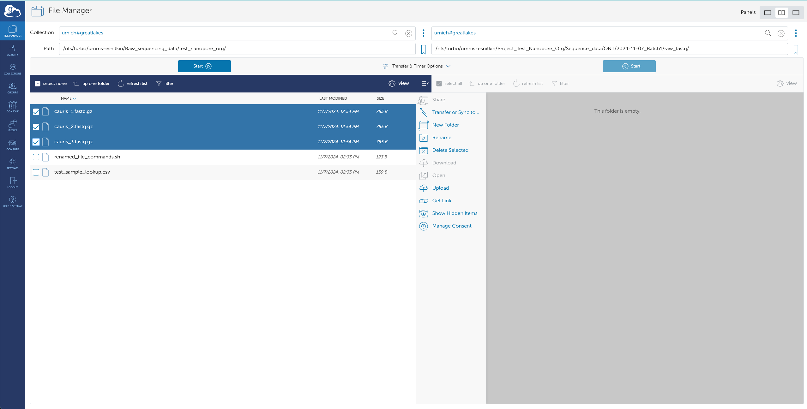
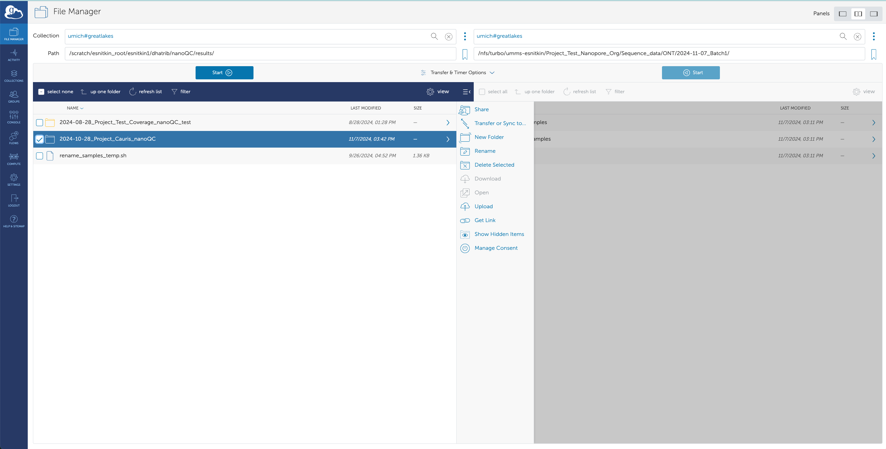

<!--
Author: Dhatri Badri
-->

# Processing nanopore samples
The following are crucial steps as part of the [Snitkin lab](https://thesnitkinlab.com/index.php) SOP to process nanopore data (long reads). 
<!--
_**COMING SOON**: To understand which scripts are being called and executed, and the different directories/folders being created, please refer to the [wiki]()._
-->
- [Processing nanopore samples](#processing-nanopore-samples)
  - [Getting started](#getting-started)
    - [Installation](#installation)
  - [Creare Project folder/directory](#create-project-folder)
  - [Rename samples](#rename-samples)
  - [Create batch directory](#create-batch-directory-to-house-the-renamed-samples)
  - [Move samples to Project directory](#move-renamed-samples-to-project-folder)
  - [Run nanoQC](#run-qcd)
  - [Move nanoQC outputs to Project directory](#move-qcd-outputs-to-project-directory)


## Getting started
You need to install the Data Flow SOP from Github and follow the directions in this document to create your project folder on turbo. _Your project folder is the name of the project you are currently working on. For example, if you are working on the MDHHS project, there is a folder called_ `Project_MDHHS` on `/nfs/turbo/umms-esnitkin/`. _**If you are unable to find your project folder (rare), please slack Evan to check if exists or if it needs to be created. If the project folder does not exist, you will have the opportunity to create it further along the SOP.**_ <!--If your project folder is already created,great—that's one less step for you to do!-->

Please ensure you are cloning the Github repository on your scratch i.e. `/scratch/esnitkin_root/esnitkin1/your_uniqname/`. **All the steps in this SOP depend on your successful completion of the preceding steps.** If you are unable to find the relevant files and/or the instructions are unclear, **_please slack Dhatri and do not move forward with the SOP_**.  <!--This script should be run in the directory you are currently in but the path you give is the path to your (already/newly created) project folder on turbo. -->


### Installation

> Firstly, navigate to your scratch directory. Your path should look something like this: `/scratch/esnitkin_root/esnitkin1/uniqname/`

```
cd /scratch/esnitkin_root/esnitkin1/dhatrib/
```

> Once you are in your scratch, clone the github directory onto your system.

```
git clone https://github.com/Snitkin-Lab-Umich/Data-Flow-SOP.git
```
> If you have successfully cloned the Gtihub repository on your scratch directory, you should see the following messages. 

```
(base) [dhatrib@gl-login2 dhatrib]$ pwd
/scratch/esnitkin_root/esnitkin99/dhatrib
(base) [dhatrib@gl-login2 dhatrib]$ git clone https://github.com/Snitkin-Lab-Umich/Data-Flow-SOP.git
Cloning into 'Data-Flow-SOP'...
remote: Enumerating objects: 11, done.
remote: Counting objects: 100% (11/11), done.
remote: Compressing objects: 100% (8/8), done.
remote: Total 11 (delta 1), reused 8 (delta 1), pack-reused 0 (from 0)
Receiving objects: 100% (11/11), 10.18 KiB | 10.18 MiB/s, done.
Resolving deltas: 100% (1/1), done.
```


> Ensure you have successfully cloned Data-Flow-SOP. Type `ls` and you should see the newly created directory Data-Flow-SOP. Move to the newly created directory. This is what `Data-Flow-SOP` should look like.

```
(base) [dhatrib@gl-login2 dhatrib]$ ls
Data-Flow-SOP
(base) [dhatrib@gl-login2 dhatrib]$ pwd
/scratch/esnitkin_root/esnitkin99/dhatrib
(base) [dhatrib@gl-login2 dhatrib]$ cd Data-Flow-SOP/
(base) [dhatrib@gl-login2 Data-Flow-SOP]$ pwd
/scratch/esnitkin_root/esnitkin99/dhatrib/Data-Flow-SOP
(base) [dhatrib@gl-login2 Data-Flow-SOP]$ ls
create_directories.py        hybrid    nanopore  processing-hybrid-samples.md    processing-nanopore-samples.md
create_higher_level_dirs.py  illumina  pics      processing-illumina-samples.md  README.md
```

## Create project folder 
 
**If your project folder already exists, skip to this [step](#Rename-samples).**

_**If you project folder does not exist, follow the steps below.**_ 

The following script, `create_higher_level_dirs.py`, will create your Project folder for you. <!--This script will be used for newer projects—most likely, your project folder has already been created. **Do not install tools/run any computationally intensive tasks on turbo i.e. `/nfs/turbo/umms-esnitkin/`**. -->


1. To get started, type this command `python3 create_higher_level_dirs.py -h`. This will give you an idea of all the flags present in the script and what you need to specify for each argument as seen below. 


```
(base) [dhatrib@gl-login3 Data-Flow-SOP]$ python3 create_higher_level_dirs.py -h
usage: create_higher_level_dirs.py [-h] --dest_path DEST_PATH --project_name PROJECT_NAME --data_type {illumina,nanopore,both}

Create project folder and higher level directory structure for illumina data.

options:
  -h, --help            show this help message and exit
  --dest_path DEST_PATH
                        Destination path where directories need to be created—do NOT include project name (e.g., /nfs/turbo/umms-
                        esnitkin/)
  --project_name PROJECT_NAME
                        Name of your project (format: Project_Name-of-Project, e.g., Project_MDHHS)
  --data_type {illumina,nanopore,both}
                        Type of data (illumina/nanopore/both)
```

2. Create project folder and its relevant sub-directories. <!-- If your project folder already exists, this script will create the relevant subdirectories in that folder. --> _This script is case-sensitive—if you wanted to create the Project name `MERLIN` but gave `MERLiN` it will create the directories in `/nfs/turbo/umms-esnitkin/Project_MERLiN`, instead of `/nfs/turbo/umms-esnitkin/Project_MERLIN`._

> The `--dest_path` should be the path to turbo on Great Lakes i.e. `/nfs/turbo/umms-esnitkin/`, `--project_name` should be the name of your project and `--data_type` is nanopore. 

```
python3 create_higher_level_dirs.py --dest_path /nfs/turbo/umms-esnitkin/ --project_name Project_Test_Nanopore_Org --data_type nanopore
```

> Once you have successfully created the relevant subdirectories, you should see the below messages on your terminal.

```
(base) [dhatrib@gl-login3 Data-Flow-SOP]$ python3 create_higher_level_dirs.py --dest_path /nfs/turbo/umms-esnitkin/ --project_name Project_Test_Nanopore_Org --data_type nanopore

Metadata and subdirectories created successfully at /nfs/turbo/umms-esnitkin/Project_Test_Nanopore_Org/Sequence_data/metadata.

Variant calling folder created successfully at /nfs/turbo/umms-esnitkin/Project_Test_Nanopore_Org/Sequence_data/variant_calling.

Assembly directory structure created successfully at /nfs/turbo/umms-esnitkin/Project_Test_Nanopore_Org/Sequence_data/assembly.

Created ONT directory structure under /nfs/turbo/umms-esnitkin/Project_Test_Nanopore_Org

Success! All specified directories have been created.
```

3. Visualize Project directory structure: `tree /nfs/turbo/umms-esnitkin/Project_Test_Nanopore_Org/` to look at the Project folder and relevant directories created.

```
(base) [dhatrib@gl-login3 Data-Flow-SOP]$ tree /nfs/turbo/umms-esnitkin/Project_Test_Nanopore_Org/
/nfs/turbo/umms-esnitkin/Project_Test_Nanopore_Org/
└── Sequence_data
    ├── assembly
    │   └── ONT
    ├── metadata
    │   ├── AGC_submission
    │   ├── plasmidsaurus
    │   └── sample_lookup
    ├── ONT
    └── variant_calling

9 directories, 0 files
```

***STOP AND CHECK***: If your Project folder i.e. `/nfs/turbo/umms-esnitkin/Project_Test_Nanopore_Org` does not contain the directories seen above, please review the path(s) you provided to the flags specified in `create_higher_level_dirs.py` on your terminal. 

If your Project directory looks like the above, you are ready to move to the next step. 

## Rename samples

4. Once you have created the Project folder/confirmed the existence of an already created Project folder, navigate to this directory `/nfs/turbo/umms-esnitkin/Raw_sequencing_data/` and find the folder corresponding to your dataset. Rename samples using demultiplex file `DemuxStats_*.csv`. 

> Move to `Raw_sequencing_data` folder and navigate to your corresponding dataset folder.

```
cd /nfs/turbo/umms-esnitkin/Raw_sequencing_data
ls
cd your/samples/folder
```
> For the sake of this tutorial, we will be using the samples in `test_nanopore_org`.
```
(base) [dhatrib@gl-login3 dhatrib]$ cd /nfs/turbo/umms-esnitkin/Raw_sequencing_data/
(base) [dhatrib@gl-login3 Raw_sequencing_data]$ ls
10728-ES  27MSPS_fastq    9FSQ29_fastq    G6C                                 N3TG4Y_results  S6HSTY_results     Y9RJY8_fastq
10909-ES  27MSPS_results  9FSQ29_results  G6C_rerun                           R5G             test_illumina_org  Y9RJY8_results
11091-ES  98CML4_fastq    B5JNZD_fastq    move_long_reads_to_corr_folders.sh  R5G_rerun       VTVLPR_1           ZJ9XL5_fastq
11143-ES  98CML4_results  B5JNZD_results  N3TG4Y_fastq                        S6HSTY_1        VTVLPR_results     ZJ9XL5_results
(base) [dhatrib@gl-login3 Raw_sequencing_data]$ cd test_nanopore_org/
(base) [dhatrib@gl-login3 test_nanopore_org]$ ls
test_1.fastq.gz  test_2.fastq.gz  test_3.fastq.gz  test_sample_lookup.tsv
```


> To understand how to use the bash script, execute the following command

```
/scratch/esnitkin_root/esnitkin1/path/to/Data-Flow-SOP/nanopore/rename_samples_nanopore.sh 
```


> You will need to supply the name of the folder that contains the fastqs and a lookup file called `*_sample_lookup.csv` where the **_*_** is the name of your dataset. If you are unable to find the fastq folder and/or the lookup file, **please do not move forward with the following steps and slack Evan**. 

```
/scratch/esnitkin_root/esnitkin1/path/to/Data-Flow-SOP/rename_samples.sh fastq_folder *_sample_lookup.csv Batch_X
```

```
(base) [dhatrib@gl-login2 test_nanopore_org]$ /scratch/esnitkin_root/esnitkin1/dhatrib/Data-Flow-SOP/nanopore/rename_samples_nanopore.sh . test_sample_lookup.csv Batch_1
Renaming sample ./test_1.fastq.gz to ./cauris_1.fastq.gz
Renaming sample ./test_2.fastq.gz to ./cauris_2.fastq.gz
Renaming sample ./test_3.fastq.gz to ./cauris_3.fastq.gz
Renaming completed. Check renamed_file_commands.sh for details.
```

5. The samples should have been renamed. There will be a new file generated called `renamed_file_commands.sh`. This file contains a bunch of move commands (`mv`) that show the names of the old files and their corresponding renamed file names. 

> Check if the file has been created: 

```
ls /nfs/turbo/umms-esnitkin/Raw_sequencing_data/your/samples/folder
```

> Confirm the creation of `renamed_file_commands.sh`

```
(base) [dhatrib@gl-login2 test_nanopore_org]$ ls
cauris_1.fastq.gz  cauris_2.fastq.gz  cauris_3.fastq.gz  renamed_file_commands.sh  test_sample_lookup.csv
```

>Inspect contents of the file. Hit `q` to exit. 

```
less /nfs/turbo/umms-esnitkin/Raw_sequencing_data/your/samples/folder/renamed_file_commands.sh
```

> Quick sanity check to ensure all samples have been renamed.  

```

mv ./test_1.fastq.gz ./cauris_1.fastq.gz
mv ./test_2.fastq.gz ./cauris_2.fastq.gz
mv ./test_3.fastq.gz ./cauris_3.fastq.gz
....
(END)
```

> Ensure all the files have been renamed. Navigate to the fastq folder. If samples have been renamed, we can move to the next step in the SOP.

```
(base) [dhatrib@gl-login2 test_nanopore_org]$ ls
cauris_1.fastq.gz  cauris_2.fastq.gz  cauris_3.fastq.gz  renamed_file_commands.sh  test_sample_lookup.csv
```

_**STOP AND CHECK**_: If there are some files that have not been renamed, please slack Dhatri immediately and do not move forward with the following steps.

## Create batch directory to house the renamed samples

Once the samples have been renamed, you are now ready to move them from temporary storage `Raw_sequencing_data/dataset_folder/fastq_folder` to a more permanent location—your Project folder `/nfs/turbo/umms-esnitkin/Project_Name`. 

6. Run `create_directories.py` to create the relevant subdirectories in your Project folder. Type `python3 create_directories.py -h` on your terminal. This will give you an idea of all the flags present in the script and what you need to specify for each argument as seen below. 

```
(base) [dhatrib@gl-login2 fastqs_test_illumina]$ python3 /scratch/esnitkin_root/esnitkin99/dhatrib/Data-Flow-SOP/create_directories.py -h
usage: create_directories.py [-h] --dest_path DEST_PATH --project_name PROJECT_NAME --data_type {illumina,nanopore,both}
                             [--folder_names_illumina [FOLDER_NAMES_ILLUMINA]] [--folder_names_nanopore [FOLDER_NAMES_NANOPORE]]

Create directory structure for illumina data.

options:
  -h, --help            show this help message and exit
  --dest_path DEST_PATH
                        Destination path where directories need to be created—do NOT include project name (e.g., /nfs/turbo/umms-esnitkin/)
  --project_name PROJECT_NAME
                        Name of your project (format: Project_Name-of-Project, e.g., Project_MDHHS)
  --data_type {illumina,nanopore,both}
                        Type of data (illumina/nanopore/both)
  --folder_names_illumina [FOLDER_NAMES_ILLUMINA]
                        Comma separated folder names for Illumina (if multiple) (format: date_PlateInfo, e.g., 2024-12-24_Plate1-to-
                        Plate3,2024-12-25_Plate4-to-Plate6)
  --folder_names_nanopore [FOLDER_NAMES_NANOPORE]
                        Comma separated folder names for Nanopore (if multiple) (format: date_PlateInfo, e.g., 2024-09-14_Plate4-to-
                        Plate6,2024-09-15_Plate7-to-Plate10)
```
**_If you are unsure which batch your samples are from, click [here](https://docs.google.com/spreadsheets/d/1L4ic5RthXNmEkHlSogRKZghZ0EPi2UT3ri6RUaguQEU/edit?gid=2116112669#gid=2116112669). If you are unable to open the link, slack Evan for access to the excel._**

> Create the batch folders and respective subdirectories in your project folder.

```
python3 /scratch/esnitkin_root/esnitkin99/dhatrib/Data-Flow-SOP/create_directories.py --dest_path /nfs/turbo/umms-esnitkin/ --project_name Project_Test_Nanopore_Org --data_type nanopore --folder_names_nanopore 2024-11-07_Batch1
```
> If the directories were created successfully, you should see the following messages.

```
(base) [dhatrib@gl-login2 test_nanopore_org]$ python3 /scratch/esnitkin_root/esnitkin1/dhatrib/Data-Flow-SOP/create_directories.py  --dest_path /nfs/turbo/umms-esnitkin/ --project_name Project_Test_Nanopore_Org --data_type nanopore --folder_names_nanopore 2024-11-07_Batch1

Validating folders at /nfs/turbo/umms-esnitkin/Project_Test_Nanopore_Org for data type nanopore

Metadata and subdirectories created successfully at /nfs/turbo/umms-esnitkin/Project_Test_Nanopore_Org/Sequence_data/metadata.

Variant calling folder created successfully at /nfs/turbo/umms-esnitkin/Project_Test_Nanopore_Org/Sequence_data/variant_calling.

Creating assembly directory at /nfs/turbo/umms-esnitkin/Project_Test_Nanopore_Org/Sequence_data/assembly

Assembly directory structure created successfully.

Creating ONT directory structure for 2024-11-07_Batch1 under /nfs/turbo/umms-esnitkin/Project_Test_Nanopore_Org

ONT directory structure for 2024-11-07_Batch1 created successfully.

Success! All specified directories have been created.
```

7. Visualize updated directory structure of plate folder and its subdirectories in the project folder: `tree /nfs/turbo/umms-esnitkin/Project_Test_Nanopore_Org`

```
(base) [dhatrib@gl-login2 test_nanopore_org]$ tree /nfs/turbo/umms-esnitkin/Project_Test_Nanopore_Org
/nfs/turbo/umms-esnitkin/Project_Test_Nanopore_Org
└── Sequence_data
    ├── assembly
    │   └── ONT
    ├── metadata
    │   ├── AGC_submission
    │   ├── plasmidsaurus
    │   └── sample_lookup
    ├── ONT
    │   ├── 2024-11-07_Batch1
    │   │   ├── failed_qc_samples
    │   │   ├── passed_qc_samples
    │   │   └── raw_fastq
    │   └── clean_fastq_qc_pass_samples
    └── variant_calling

14 directories, 0 files
```

_**STOP AND CHECK**_: If your batch directory aka `../Sequence_data/ONT/2024-11-07_Batch1/` does not have the sub-directories as seen above, do not move on and slack Dhatri. 


## Move renamed samples to Project folder 
8. Before you move nanoQC results, we need to move the renamed samples to your Project folder i.e. the path to your Project folder on turbo. 

> Log onto [globus](https://app.globus.org/file-manager?two_pane=true). Move only the fastq files from  `/nfs/turbo/umms-esnitkin/Raw_sequencing_data/test_nanopore_org/` to the `raw_fastq` folder in your Project folder on turbo i.e. `/nfs/turbo/umms-esnitkin/Project_Test_Nanopore_Org/Sequence_data/ONT/2024-11-07_Batch1/raw_fastq/` by clicking the **Start** button.



> Move the rest of the files found in your dataset folder `mv README.md renamed_file_commands.sh  /nfs/turbo/umms-esnitkin/Project_Name/Sequence_data/metadata/sample_lookup` to the `metadata/sample_lookup` folder. E.g. of files that can be found the Demultiplex lookup file (`*_sample_lookup.csv`), `README` (if applicable), `renamed_file_commands.sh`.  

```
(base) [dhatrib@gl-login3 test_nanopore_org]$ ls
renamed_file_commands.sh  test_sample_lookup.csv
(base) [dhatrib@gl-login3 test_nanopore_org]$ mv renamed_file_commands.sh test_sample_lookup.csv /nfs/turbo/umms-esnitkin/Project_Test_Nanopore_Org/Sequence_data/metadata/sample_lookup
(base) [dhatrib@gl-login3 test_nanopore_org]$ cd /nfs/turbo/umms-esnitkin/Project_Test_Nanopore_Org/Sequence_data/metadata/sample_lookup
(base) [dhatrib@gl-login3 sample_lookup]$ ls
test_sample_lookup.csv  renamed_file_commands.sh
```


## Run nanoQC

9. You are now ready to start processing your short reads. We will be using one of our in house pipelines, [nanoQC](https://github.com/Snitkin-Lab-Umich/nanoQC), to run on the renamed samples. Click on the link and follow the instructions as described on the Github page. 

_**STOP AND CHECK**_: If you run into any issues running nanoQC, please slack Dhatri immediately and do not move forward with the following steps. Ensure you have generated the QC report before moving on.

## Move nanoQC results to Project directory

Once you have finished running nanoQC on your scratch directory and globus has succesfully transferred the raw fastq files, you are ready to move importatn QCD outputs to your Project folder. 

10. Move nanoQC outputs using [globus](https://app.globus.org/file-manager?two_pane=true) since the output files are massive and take a while to transfer.

> Log onto [globus](https://app.globus.org/file-manager?two_pane=true). Move only the nanoQC results directory i.e. `2024-10-28_Project_Cauris_nanoQC` from  `/scratch/esnitkin_root/esnitkin1/dhatrib/nanoQC/results/2024-10-28_Project_Cauris_nanoQC/` to the `ONT` folder in your Project directory on turbo i.e. `/nfs/turbo/umms-esnitkin/Project_Test_Nanopore_Org/Sequence_data/ONT/2024-11-07_Batch1/`



11. Once you have confirmed that the results has been moved (you should get an email from globus), create a folder, `nanoQC_snakemake_pipeline`, in your newly moved results folder here `/nfs/turbo/umms-esnitkin/Project_Test_Nanopore_Org/Sequence_data/ONT/2024-11-07_Batch1/`.

> `cd` into your nanoQC results folder and create a new folder `nanoQC_snakemake_pipeline`.

```
(base) [dhatrib@gl-login3 nanoQC]$ cd /nfs/turbo/umms-esnitkin/Project_Test_Nanopore_Org/Sequence_data/ONT/2024-11-07_Batch1/2024-10-28_Project_Cauris_nanoQC
(base) [dhatrib@gl-login3 2024-10-28_Project_Cauris_nanoQC]$ mkdir nanoQC_snakemake_pipeline
(base) [dhatrib@gl-login3 2024-10-28_Project_Cauris_nanoQC]$ ls
2024-10-28_Project_Cauris_nanoQC_report nanoQC_snakemake_pipeline  filtlong  flye  medaka ....
```
<!-- >
12. Start and interative session and navigate to your QCD results folder.

> Start an interactive session. Increase/decrease `--cpus-per-task` and `--time` according to your sample size. 
```
srun --account=esnitkin1 --nodes=1 --ntasks-per-node=1 --mem-per-cpu=5GB --cpus-per-task=3 --time=7:00:00 --pty /bin/bash
```

> Ensure you are in the right directory.
```
cd /scratch/esnitkin_root/esnitkin1/uniqname/path/to/QCD
```

> This is what you should be seeing after finishing the 2 steps above. 
```
(base) [dhatrib@gl-login3 QCD]$ srun --account=esnitkin1 --nodes=1 --ntasks-per-node=1 --mem-per-cpu=5GB --cpus-per-task=3 --time=8:00:00 --pty /bin/bash
srun: job 12759868 queued and waiting for resources
srun: job 12759868 has been allocated resources
(base) [dhatrib@gl3021 QCD]$ ls
config    QCD.smk   QCD_report.smk README.md ...
```
-->
> Move into your results folder and copy the Snakefiles, config, samples and cluster files to your plate directory.

```
(base) [dhatrib@gl3021 QCD]$ mv workflow/nanoQC.smk QCD_report.smk config/config.yaml config/samples.csv config/cluster.json /nfs/turbo/umms-esnitkin/Project_Test_Illumina_Org/Sequence_data/illumina_fastq/2024-08-21_Plate1-to-Plate3/2024-06-04_Project_Merlin_QCD/QCD_snakemake_pipeline
(base) [dhatrib@gl3021 QCD]$ ls /nfs/turbo/umms-esnitkin/Project_Test_Illumina_Org/Sequence_data/illumina_fastq/2024-08-21_Plate1-to-Plate3/2024-06-04_Project_Merlin_QCD/QCD_snakemake_pipeline
QCD.smk QCD_report.smk config.yaml samples.csv cluster.json
```


13. Once you have confirmed that the results has been moved (you should get an email from globus), you are now ready to move the results from QCD to the respective folders in your plate directory using `move_files_to_directories_illumina.py`. To understand how to use the python script, try `python3 /scratch/esnitkin_root/esnitkin1/uniqname/path/to/Data-Flow-SOP/move_files_to_directories_illumina.py -h`.

```
(base) [dhatrib@gl3021 results]$ python3 /scratch/esnitkin_root/esnitkin99/dhatrib/Data-Flow-SOP/move_files_to_directories_illumina.py -h
usage: move_files_to_directories_illumina.py [-h] --plate_info_path PLATE_INFO_PATH --qcd_results_path QCD_RESULTS_PATH

Process and organize illumina sequencing data.

options:
  -h, --help            show this help message and exit
  --plate_info_path PLATE_INFO_PATH
                        Path to the date_PlateInfo directory (e.g., /nfs/turbo/umms-
                        esnitkin/Project_Marimba/Sequence_data/illumina_fastq/2024-12-24_Plate1-to-Plate3)
  --qcd_results_path QCD_RESULTS_PATH
                        Path to the QCD results directory (e.g.,
                        /nfs/turbo/umms-esnitkin/Project_Test_Illumina_Org/Sequence_data/illumina_fastq/2024-08-21_Plate1-to-Plate3/2024-06-04_Project_Merlin_QCD/)
```

> Ensure you have the paths to your plate directory i.e. `/nfs/turbo/umms-esnitkin/Your_Project/Sequence_data/illumina_fastq/date_PlateNum` and QCD results i.e. `/nfs/turbo/umms-esnitkin/Project_Test_Illumina_Org/Sequence_data/illumina_fastq/2024-08-21_Plate1-to-Plate3/2024-06-04_Project_Merlin_QCD/` handy.

```
python3 /scratch/esnitkin_root/esnitkin99/dhatrib/Data-Flow-SOP/move_files_to_directories_illumina.py --plate_info_path /nfs/turbo/umms-esnitkin/Your_project_folder/Sequence_data/illumina_fastq/2024-08-21_Plate1-to-Plate3 --qcd_results_path /nfs/turbo/umms-esnitkin/Project_Test_Illumina_Org/Sequence_data/illumina_fastq/2024-08-21_Plate1-to-Plate3/2024-06-04_Project_Merlin_QCD
```

**Your terminal window that you used to move the QCD outputs will be busy and it will take anywhere from 1-4 hours (sometimes more depending on the number of samples you have) to move the files. Please open another tab/terminal window if you need to contine using the terminal to work on other things.** 

> The message you will see once your files have moved successfully.

```
(base) [dhatrib@gl3021 results]$ python3 /scratch/esnitkin_root/esnitkin99/dhatrib/Data-Flow-SOP/move_files_to_directories_illumina.py --plate_info_path /nfs/turbo/umms-esnitkin/Project_Test_Illumina_Org/Sequence_data/illumina_fastq/2024-08-21_Plate1-to-Plate3 --qcd_results_path /scratch/esnitkin_root/esnitkin1/dhatrib/Testing_dir_structure_illumina/results/2024-06-04_Project_Merlin_QCD
Created master QC summary file at: /nfs/turbo/umms-esnitkin/Project_Test_Illumina_Org/Sequence_data/illumina_fastq/master_qc_summary.csv
Appended /nfs/turbo/umms-esnitkin/Project_Test_Illumina_Org/Sequence_data/illumina_fastq/2024-08-21_Plate1-to-Plate3/2024-06-04_Project_Merlin_QCD/2024-06-04_Project_Merlin_QCD_Report/data/2024-06-04_Project_Merlin_QCD_QC_summary.csv to /nfs/turbo/umms-esnitkin/Project_Test_Illumina_Org/Sequence_data/illumina_fastq/master_qc_summary.csv
Yay, all files were transferred to their respective folders successfully!
Yay, samples from passed_samples.txt file have been moved to clean_fastq_qc_pass_samples directory!
Yay, all specified samples have been moved to the assembly directory successfully!
```

***If you see the above message, you have finished QC-ing your short reads and are ready to move forward with downstream analysis. Happy sciencing!***

<!-- >
### Rule of thumb(s):
If you think you are going to be performing/carrying out computationally intensive tasks that are going to use more than 2 cores and/or 4G of memory, open an interactive session.
-->